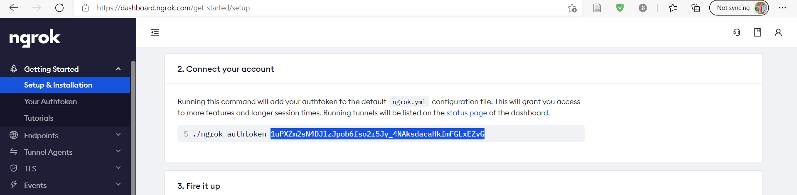
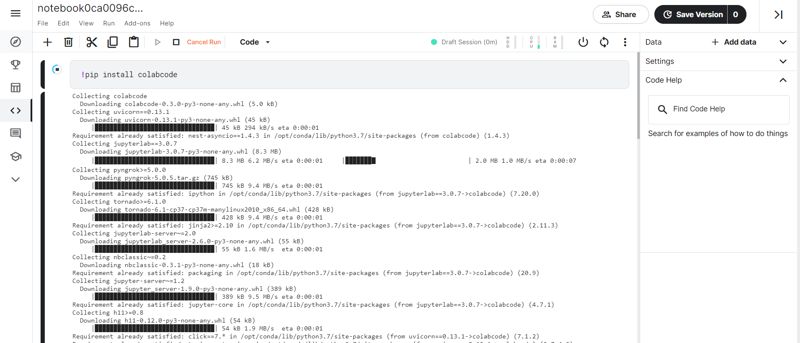
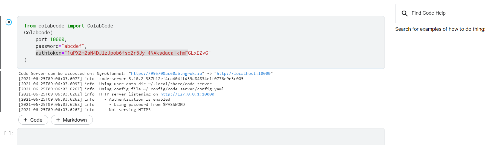
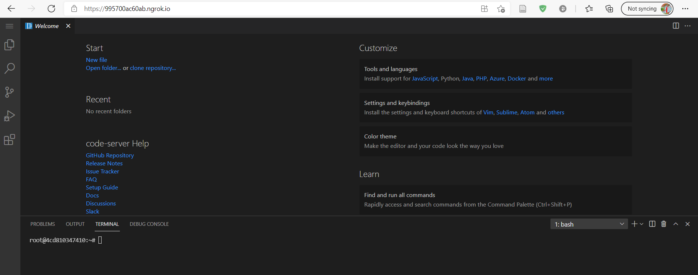
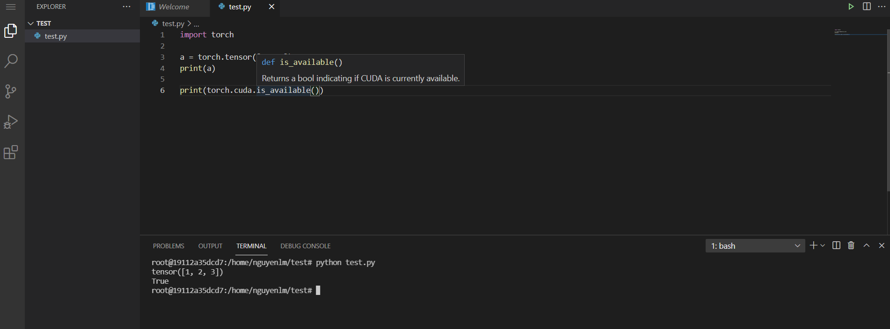
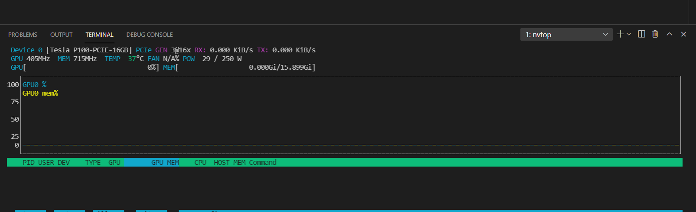
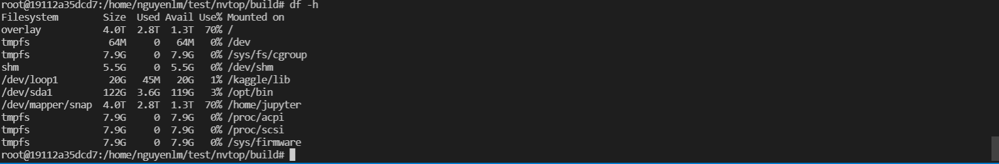

<h3 align="left">
    <p>😳 Chạy Kaggle hoặc Colab trên Vscode </p>
</h3>

Cơ chế hoạt động của cái này là sẽ dùng bên thứ 3 `ngrok` để connect `VS Code` và `Kaggle` (hoặc `Colab`). Ở hướng dẫn này thì mình dùng `Kaggle`.


### Step1: Tạo tài khoản trên ngrok tại địa chỉ https://dashboard.ngrok.com/signup sau đó copy cái authtoken ở trang Setup & Installation



### Step2: Tạo file notebook mới trên Kaggle sau đó cài thư viện colabcode (Google Colab tương tự), nhớ turn on cả GPU để server VS Code dùng được GPU

```sh
!pip install colabcode
```



### Step3: Kết nối tới server của ngrok

```python
from colabcode import ColabCode
ColabCode(
    port=10000, 
    password="abcdef", 
    authtoken="1uPXZm2sN4DJlzJpob6fso2r5Jy_4NAksdacaHkfmFGLxEZvG"
)
```
Thông tin tham số:
- `port`: cổng kết nối tới ngrok
- `password` (optional): password để connect tới server vscode
- `authtoken`: token lấy từ ngrok tại B1, mục đích của cái token là giúp không bị limit connection tới ngrok



Click vào cái đường dẫn `NgrokTunnel` sau đó vào vscode server (nếu có password thì hệ thống sẽ yêu cầu thêm nhập password)



### Step4: Thử nghiệm

Mở folder bất kỳ, tạo thử file `test.python` (ở đây mình dùng folder `/home/nguyenlm/test` tự tạo bằng `mkdir -p /home/nguyenlm/test`). Ở đây check thành công sử dụng được GPU nhưng theo giới hạn của Kaggle thì chỉ dùng được 25-30h/tuần.



Cài thử `nvtop`, ở đây là server Ubuntu 18.04 và có quyền root nên khi cài thì không cần `sudo`

```sh
# install C dependencies
apt install cmake libncurses5-dev libncursesw5-dev git

# build nvtop
git clone https://github.com/Syllo/nvtop.git
mkdir -p nvtop/build && cd nvtop/build
cmake ..
make
make install
```

Chạy thử `nvtop`
  
  

Chạy thử `htop`
  
  

Chạy thử `df -h` để check bộ nhớ
  
  