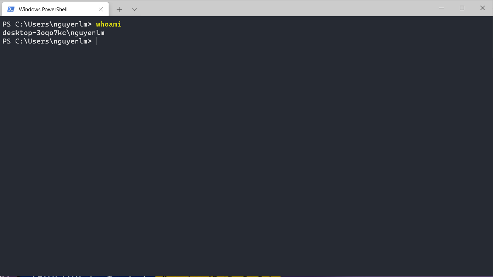
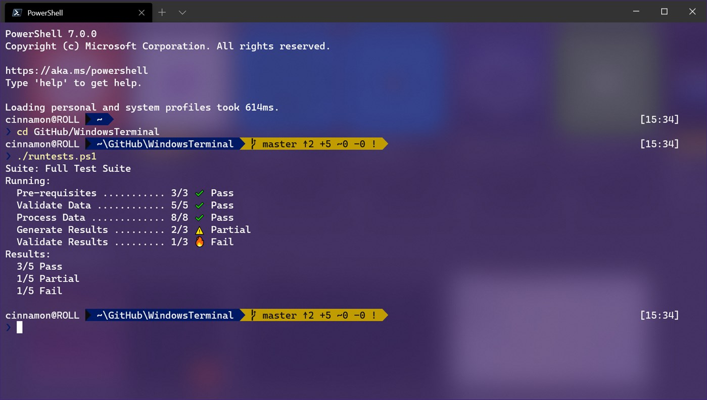

<h3 align="left">
    <p>😎 Connect to Linux server with Window Terminal </p>
</h3>

### Download window terminal

With window terminal we can use some common commands in Linux like `ls`, `cd`, `scp`, `ssh`... If you're familiar with Linux and want to use more commands, please install [WSL (Window Subsystem for Linux)](https://docs.microsoft.com/en-us/windows/wsl/install-win10?ranMID=46131&ranEAID=a1LgFw09t88&ranSiteID=a1LgFw09t88-wsO_vuOpJsLH4s92WtO5iw&epi=a1LgFw09t88-wsO_vuOpJsLH4s92WtO5iw&irgwc=1&OCID=AID2200057_aff_7806_1243925&tduid=%28ir__bl2gtjnvwgkfqzuf0iq621u0ze2xrkty3g0rltd200%29%287806%29%281243925%29%28a1LgFw09t88-wsO_vuOpJsLH4s92WtO5iw%29%28%29&irclickid=_bl2gtjnvwgkfqzuf0iq621u0ze2xrkty3g0rltd200).

Link download: [window terminal download](https://www.microsoft.com/en-us/p/windows-terminal/9n0dx20hk701?ranMID=46131&ranEAID=a1LgFw09t88&ranSiteID=a1LgFw09t88-DnkwG9hHnodeH5k2AklK2Q&epi=a1LgFw09t88-DnkwG9hHnodeH5k2AklK2Q&irgwc=1&OCID=AID2200057_aff_7806_1243925&tduid=%28ir__bl2gtjnvwgkfqzuf0iq621u0ze2xrkt13s0rltd200%29%287806%29%281243925%29%28a1LgFw09t88-DnkwG9hHnodeH5k2AklK2Q%29%28%29&irclickid=_bl2gtjnvwgkfqzuf0iq621u0ze2xrkt13s0rltd200&activetab=pivot:overviewtab)

Screenshot from my computer:



Screenshot get from official page:



### Connect to Linux server without password

Create public key with `ssh-keygen`, this command will create a private key and a public key, places the public key to anywhere that you want connecting to and never shares your private key to someone. By default the private key will be in `C:\Users\username\.ssh\id_rsa` and the public key will be in `C:\Users\username\.ssh\id_rsa.pub`. Run the following command.

````sh
ssh-keygen.exe
### output ###
# Generating public/private rsa key pair.
# Enter file in which to save the key (C:\Users\nguyenlm/.ssh/id_rsa):
````

Copy content of `C:\Users\username\.ssh\id_rsa.pub` to `~/.ssh/authorized_keys` file on the Linux server, if this file didn't exist just create the new one. See the following example:

````sh
### ~/.ssh/authorized_keys file
ssh-rsa AAAAB3NzaC1...nguyenlm@DESKTOP-3OQO7KC

### we can place mutiple public keys to this file
ssh-rsa key2...nguyenlm@DESKTOP-3OQO7KC
ssh-rsa key3...nguyenlm@DESKTOP-3OQO7KC
...
````

Try to connect to Linux server, if you don't have the ssh key or something went wrong with your key, you should have to enter the password

````sh
ssh -p port username@server_url
````

If all steps above were successfully completed, then you have never typed password anymore (also when connecting by vscode)